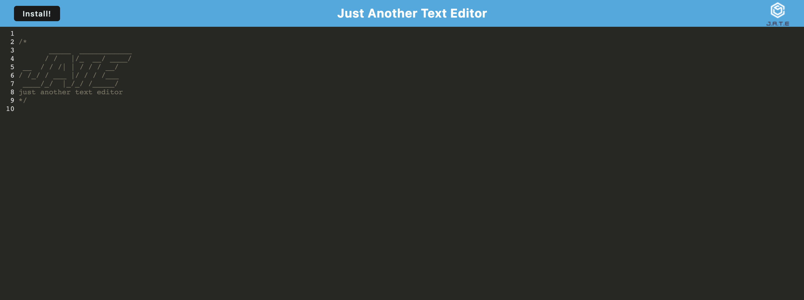

# jate-texteditor-pwa
JATE (Just Another Text Editor) is a Progressive Web App that allows users to create and keep notes even offline.

[](https://github.com/DAVFoundation/captain-n3m0/blob/master/LICENSE)



## Table of Contents

* [Technologies](#technologies)
* [Installation](#installation)
* [Feature](#feature)
* [Usage](#usage)
* [License](#license)
* [Questions](#questions)
* [Screens](#screens)


## Technologies 

* JavaScript ES6
* HTML5
* CSS3
* Node.js
* PWA
* Webpack
* Workbox

## Installation 

Following are the steps of installation and building

```
npm i
npm run start
```

## Features

* A PWA text editor that can keep notes, saves them on the go
* Works Offline
* Installable on PC and mobile platforms

## Usage 

Unrestricted usage.


## License 

MIT

## Screens

This following gif shows the whole journey of the application.

Check video for demonstartion [here](https://youtu.be/C2FjFK7jcA8)

## Questions 

If you have any more questions, please contact me here:

Github Username: [mohamedallam13](https://github.com/mohamedallam13)

Email: [mohamedallam.tu@gmail.com](mailto:mohamedallam.tu@gmail.com)

